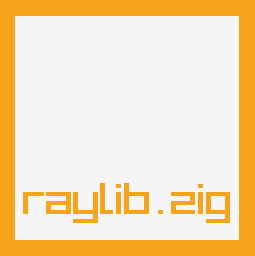

# raylib.zig
Idiomatic [raylib](https://www.raylib.com/) (4.1) bindings for [Zig](https://ziglang.org/) (0.9.1)

For example usage see: [examples-raylib.zig](https://github.com/ryupold/examples-raylib.zig)

## supported platforms
- Windows
- macOS
- Linux
- HTML5/WebGL (emscripten)

## supported APIs
- [x] RLAPI (raylib.h)
- [x] RMAPI (raymath.h)
- [x] RAYGUIAPI (extras/raygui.h)
- [x] PHYSACDEF (extras/physac.h)
- [ ] Constants
  - [x] int, float, string
  - [x] Colors
  - [x] Versions
  - [ ] GUI dimensions

## usage

The easy way would be adding this as submodule directly in your source folder.
Thats what I do until there is an official package manager for Zig.

```sh
cd $YOUR_SRC_FOLDER
git submodule add --recursive https://github.com/ryupold/raylib.zig raylib
```

The bindings have been prebuilt so you just need to import raylib.zig
```zig
const raylib = @import("raylib/raylib.zig");

pub fn main() void {
    raylib.InitWindow(800, 800, "hello world!");
    raylib.SetConfigFlags(.FLAG_WINDOW_RESIZABLE);
    raylib.SetTargetFPS(60);

    defer raylib.CloseWindow();

    while (!raylib.WindowShouldClose()) {
        raylib.BeginDrawing();
        defer raylib.EndDrawing();
        
        raylib.ClearBackground(raylib.BLACK);
        raylib.DrawFPS(10, 10);

        raylib.DrawText("hello world!", 100, 100, 20, raylib.YELLOW);
    }
}
```
> Note: you only need the files `raylib.zig`, `marshal.h` and `marshal.c` for this to work
> See `build.zig` in [examples-raylib.zig](https://github.com/ryupold/examples-raylib.zig) for how to build

## custom definitions
An easy way to fix binding mistakes is to edit them in `bindings.json` and setting the custom flag to true. This way the binding will not be overriden when calling `zig build intermediate`. 
Additionally you can add custom definitions into `inject.zig, inject.h, inject.c` these files will be prepended accordingly.

## disclaimer
I have NOT tested most of the generated functions, so there might be bugs. Especially when it comes to pointers as it is not decidable (for the generator) what a pointer to C means. Could be single item, array, sentinel terminated and/or nullable. If you run into crashes using one of the functions or types in `raylib.zig` feel free to [create an issue](https://github.com/ryupold/raylib.zig/issues) and I will look into it.

## memory
Some of the functions may return pointers to memory allocated within raylib.
Usually there will be a corresponding Unload/Free function to dispose it. You cannot use a Zig allocator to free that:

```zig
const data = LoadFileData("test.png");
defer UnloadFileData(data);

// using data...
```

## generate bindings 
for current raylib source (submodule)

```sh
zig build parse # create JSON files with raylib_parser
zig build intermediate # generate bindings.json (keeps definitions with custom=true)
zig build bindings # write all intermediate bindings to raylib.zig
```

For easier diffing and to follow changes to the raylib repository I commit also the generated json files.

## build raylib_parser (executable)
If you want to build the raylib_parser executable without a C compiler.
```sh
zig build raylib_parser
```

you can then find the executable in `./zig-out/bin/`